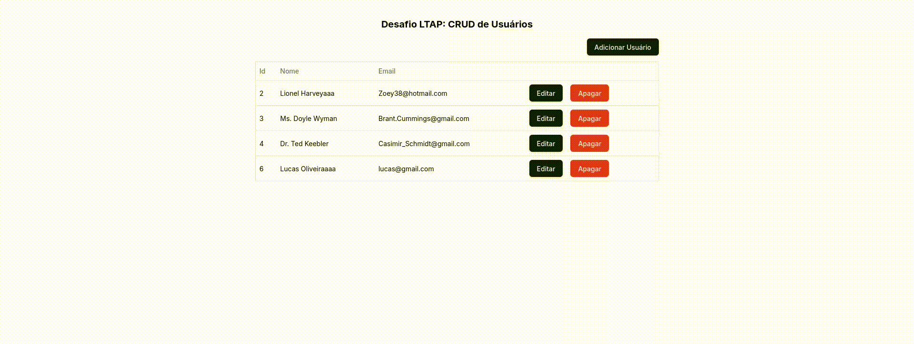

# Teste LTAP

Este é um teste técnico proposto pela LTAP, que consiste em desenvolver uma aplicação que implemente um crud simples, para uma entidade qualquer, fazendo as requisições para uma api publica.

## Tecnologias Utilizadas

<div style="display: flex; align-items: center; gap: 15px">
  
  
  
  
  
</div>

<h4>Também foi usado:</h4>
<ul>
  <li>Easy-Peasy para gerenciamento de estados globais</li>
  <li>Shadcn-UI para desenvolvimento da interface</li>
  <li>MockAPI pra fazer as requisições do CRUD</li>
</ul>

## Preview

</img>

## Instalação do Projeto
```sh
# 1. Clone o repositório na sua máquina
git clone https://github.com/aaglis/desafio-ltap.git
```

```bash
# 2. Instale as dependências
npm install
# or
yarn install
# or
pnpm install
```

```bash
# 3. Rode o projeto
npm run dev
# or
yarn dev
# or
pnpm dev
```

Agora é só abrir o projeto na porta
[http://localhost:5173](http://localhost:5173) !
